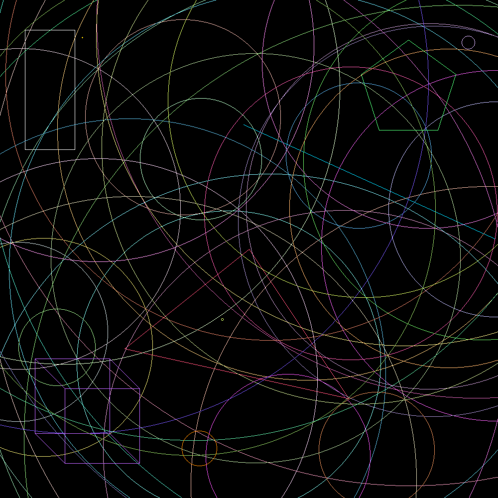

# Drawing на Rust

Учебный проект 01-edu для отрисовки геометрических фигур в растровое PNG-изображение.

В проекте реализованы точка, линия, треугольник, прямоугольник и окружность, а также бонусные фигуры — правильный пятиугольник и каркасная 2D-проекция куба. Фигуры работают через общие трейты `Drawable` и `Displayable`, поэтому алгоритмы рисования не привязаны напрямую к `raster::Image` и могут проверяться на тестовом холсте.



## 📋 Содержание

- [Запуск](#-запуск)
- [О проекте](#-о-проекте)
- [Фигуры](#-фигуры)
- [Алгоритмы](#-алгоритмы)
- [Случайная генерация](#-случайная-генерация)
- [Архитектура](#️-архитектура)
- [Тесты и проверка](#-тесты-и-проверка)
- [Структура проекта](#-структура-проекта)
- [Ограничения](#️-ограничения)
- [Автор](#-автор)

## 🚀 Запуск

Требуется установленный stable Rust toolchain с `cargo`, `rustfmt` и `clippy`.

```bash
git clone <repository-url>
cd drawing

cargo run
```

После успешного запуска в корне проекта создаётся файл:

```text
image.png
```

Полная проверка проекта:

```bash
cargo fmt
cargo clippy --all-targets -- -D warnings
cargo test
cargo run
```

## 📝 О проекте

Программа создаёт чёрное изображение размером `1000 × 1000` пикселей и последовательно рисует на нём:

- случайную линию;
- случайную точку;
- прямоугольник;
- треугольник;
- 49 случайных окружностей;
- окружность с фиксированным цветом;
- правильный пятиугольник;
- каркасную проекцию куба.

Пятиугольник, куб и фиксированная окружность рисуются после случайных окружностей, поэтому остаются заметными на итоговом изображении.

Основные зависимости зафиксированы точными версиями:

```toml
rand = "=0.8.5"
raster = "=0.2.0"
```

## ✨ Фигуры

### Point

`Point` хранит целочисленные координаты и рисуется крестом из пяти пикселей: центрального и четырёх соседних.

```rust
Point::new(x, y)
Point::random(width, height)
```

### Line

Линия хранит собственные копии начальной и конечной точек. Поддерживаются все направления, включая вертикальные, горизонтальные и вырожденные линии.

```rust
Line::new(&start, &end)
Line::random(width, height)
```

### Triangle и Rectangle

Треугольник соединяет три переданные вершины. Прямоугольник нормализует координаты через `min` и `max`, поэтому порядок входных точек не влияет на результат.

```rust
Triangle::new(&first, &second, &third)
Rectangle::new(&first, &second)
```

### Circle

Окружность хранит центр, радиус и цвет конкретного экземпляра.

```rust
Circle::new(&center, radius)
Circle::random(width, height)
```

`Circle::new` использует фиксированный оранжевый цвет. `Circle::random` создаёт и сохраняет собственный случайный яркий цвет.

Нулевой радиус допустим и рисует центральную координату. Отрицательный радиус отклоняется через `assert!`.

### Pentagon

Пять вершин правильного пятиугольника вычисляются на окружности заданного радиуса. Первая вершина направлена вверх, остальные расположены с угловым шагом `2π / 5`.

```rust
Pentagon::new(&center, radius)
```

Координаты вершин округляются через `round()`. Нулевой радиус допустим, отрицательный отклоняется.

### Cube

Куб представлен двумя квадратами и четырьмя соединяющими рёбрами — всего 12 рёбер.

```rust
Cube::new(&top_left, size, offset)
```

Задний квадрат смещается относительно переднего на `(x + offset, y + offset)`. `offset` может быть положительным, отрицательным или нулевым. Отрицательный `size` отклоняется, нулевой допустим.

## 🧮 Алгоритмы

### Линии

Все прямые рёбра рисуются одним приватным helper `draw_line`. Внутри используется целочисленный алгоритм Брезенхэма:

- работает во всех октантах;
- не использует floating-point вычисления;
- поддерживает обратный порядок точек;
- корректно обрабатывает вертикальные и горизонтальные линии;
- для совпадающих начальной и конечной точек устанавливает один пиксель.

Вычисления выполняются через `i64`, чтобы разность двух координат `i32` не переполнялась.

### Окружности

Окружности рисуются midpoint circle algorithm. На каждом шаге вычисляется одна точка дуги, после чего через восьмикратную симметрию устанавливаются пиксели во всех октантах.

### Многоугольники

Треугольник, прямоугольник и пятиугольник используют общий helper `draw_polygon`, который соединяет соседние вершины и замыкает последнюю вершину на первую.

Куб рисует два таких четырёхугольника и отдельно соединяет соответствующие вершины.

## 🎲 Случайная генерация

Все функции `random(width, height)` требуют положительные размеры:

```rust
assert!(width > 0 && height > 0);
```

Координаты случайных точек удовлетворяют ограничениям:

```text
0 <= x < width
0 <= y < height
```

Радиус случайной окружности выбирается из диапазона:

```text
1..=max(width, height)
```

Окружность может частично выходить за изображение. Выходящие пиксели безопасно отсекаются реализацией `Displayable` для `raster::Image`.

Каждый канал случайного цвета находится в диапазоне `80..=255`, при этом хотя бы один канал дополнительно усиливается до `200..=255`. Поэтому окружности не сливаются с чёрным фоном.

## ⚙️ Архитектура

Основной контракт отрисовки задают два трейта:

```rust
pub trait Displayable {
    fn display(&mut self, x: i32, y: i32, color: Color);
}

pub trait Drawable {
    fn draw<T: Displayable>(&self, image: &mut T);
    fn color(&self) -> Color;
}
```

`Drawable` зависит только от `Displayable`, а не от конкретного типа изображения.

В `main.rs` для `raster::Image` реализован `Displayable`. Реализация проверяет границы и только после этого вызывает `set_pixel`.

Внутри фигур хранятся копии `Point`, поэтому структуры не требуют lifetime-параметров. Поля всех структур приватные, публичный API состоит из типов, конструкторов, функций `random` и трейтов.

`raster::Color` реализует `Clone`, но не `Copy`, поэтому при передаче цвета каждому пикселю используется явный `clone()`.

## 🧪 Тесты и проверка

Unit-тесты находятся внутри модуля `geometrical_shapes`.

Для проверки отрисовки используется `MockImage`, реализующий `Displayable` и сохраняющий координаты установленных пикселей без создания PNG.

Проверяются:

- границы `Point::random`;
- обе точки `Line::random`;
- центр и положительный радиус `Circle::random`;
- нормализация прямоугольника при прямом и обратном порядке точек;
- вырожденная линия;
- крест из пяти пикселей для `Point`;
- окружность нулевого радиуса;
- базовая отрисовка пятиугольника и куба;
- отклонение неположительных размеров для `random`;
- отклонение отрицательных радиусов и размера куба.

Текущий результат:

```text
13 passed
0 failed
```

## 📁 Структура проекта

```text
drawing/
├── src/
│   ├── geometrical_shapes.rs  # Фигуры, трейты, алгоритмы и unit-тесты
│   └── main.rs                # Создание холста и итоговая композиция
├── .gitignore                 # Исключение Cargo build artifacts
├── Cargo.lock                 # Зафиксированное дерево зависимостей
├── Cargo.toml                 # Конфигурация проекта
├── image.png                  # Результат cargo run
└── README.md
```

## ⚠️ Ограничения

- Рисуются только контуры фигур без заливки и сглаживания.
- Результат меняется при каждом запуске из-за случайных фигур и цветов.
- Выходящие за холст пиксели обрезаются, а не масштабируются обратно в изображение.
- `raster 0.2.0` использует устаревшие транзитивные зависимости. На новых версиях Rust Cargo может показывать future-incompatibility notice для `bitflags 0.7.0`; к коду проекта это предупреждение не относится.
- Координаты куба при экстремальных значениях защищены через saturating arithmetic, поэтому фигура у границ диапазона `i32` может вырождаться.

## 🧑‍💻 Авторы
- Kamshat Berdiyeva (@komarbek)
- Nazar Yestayev (@nyestaye)
- Atabek Furkat (@abakhram)

